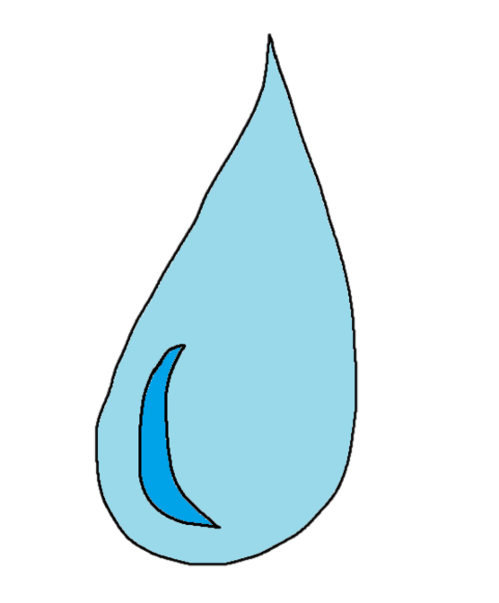

    
     
    <b>Tiny and Simple Chat Server made in Java</b>
     
    <a href="https://127.0.0.1:7777">Official Server</a>
    •
    <a href="https://youtu.be/dQw4w9WgXcQ">Free loli</a>

## DEWS

> Simple raw socket protocol to implement a simple chat system (Client-Server) made in Java.
> Not standardized (atm) with any Security Standard. Not ready for production. Under development.

## Support
This is a school project. If you'd like to support the project, feel free to open a pull request. 